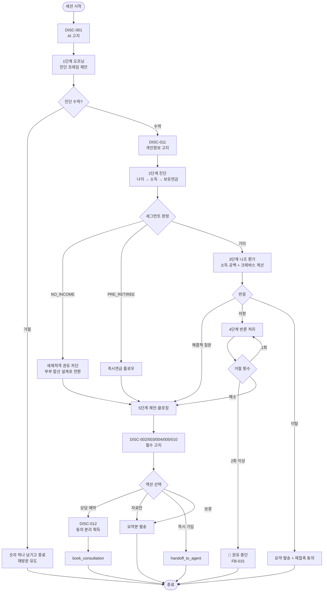
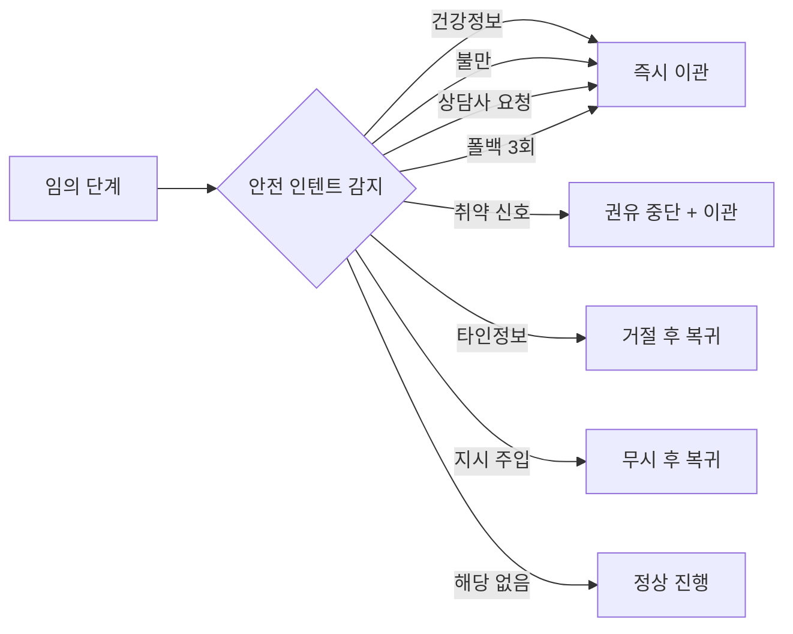

# 대화 플로우

> **버전** 1.0.0 · **최종 갱신** 2026-08-07

---

## 1. 메인 플로우



---

## 2. 안전 인터럽트 (모든 단계에서 우선 적용)



> 안전 인터럽트는 **퍼널 단계보다 우선**합니다. 5단계 클로징 직전이라도 건강정보가 언급되면 즉시 이관합니다.

---

## 3. 단계별 상세

### 1단계 — 오프닝

| 항목 | 내용 |
| --- | --- |
| 목표 | 진단 시작 수락 |
| 필수 고지 | DISC-001 (AI 고지) |
| 금지 | 상품명 언급, 가입 권유 |
| 이탈 대응 | 예상 연금액 통계 1개만 남기고 종료 |
| KPI | 진단 시작률 60% |

**프레임:** 판매가 아니라 진단. "당신의 예상 연금액을 알려드리겠다"는 정보 제공 제안으로 시작합니다.

---

### 2단계 — 진단

| 항목 | 내용 |
| --- | --- |
| 목표 | `age`, `income_band`, `owned_pension` 확보 |
| 필수 고지 | DISC-011 (개인정보 목적 한정) |
| 규칙 | 한 턴에 질문 1개, 버튼 선택지 동반 |
| 산출 | 세그먼트 판정 |
| KPI | 프로필 완료율 45% |

**이탈 방지:** 3문항을 넘기지 않습니다. 추가 정보는 필요할 때 그때그때 묻습니다.

---

### 3단계 — 니즈 환기

| 항목 | 내용 |
| --- | --- |
| 목표 | 소득 공백을 구체적 금액으로 인지 |
| 도구 | `estimate_national_pension` → `calc_income_gap` → `calc_pension_crevasse` |
| 필수 고지 | DISC-006, DISC-013, DISC-015 |
| 금지 | 공포 조장 수식어 |
| KPI | 계산 결과 열람률 40% |

**제시 순서:** 금액 공백 → 시점 공백(크레바스). 시점 리스크가 금액 리스크보다 전환력이 높습니다.

---

### 4단계 — 반론 처리

| 항목 | 내용 |
| --- | --- |
| 목표 | 저항 해소 후 5단계 진입 |
| 구조 | 인정 → 재정의 → 근거 → 작은 다음 행동 |
| 상태 | `rejection_count` 추적 |
| 중단 조건 | `rejection_count >= 2` |
| KPI | 반론 후 대화 유지율 55% |

**반론별 라우팅**

| 반론 | 대응 | 도구 |
| --- | --- | --- |
| 여유 없음 | 소액 시작 + 유예 안내 | — |
| 나중에 | 지연 비용 제시 | `compare_start_timing` |
| 국민연금 충분 | 소득대체율 43%의 전제 설명 | `get_statistic` |
| 수익률 불신 | 목적 차이 + 사업비 인정 | — |
| 유동성 부담 | 비상금 우선 + 유예 | — |
| 배우자 상의 | 요약본 발송 | — |

---

### 5단계 — 제안·클로징

| 항목 | 내용 |
| --- | --- |
| 목표 | 상담 예약 / 자료 수령 |
| 도구 | `search_product_kb`, `calc_tax_credit`, `calc_early_withdrawal_loss` |
| 필수 고지 | DISC-002, 003, 004, 005, 007, 008, 010, 014 |
| 금지 | 마감 압박, 계약 체결 처리 |
| KPI | 액션 전환율 12% |

**제시 규칙:** 상품 2안을 비교로 제시하되 우열을 매기지 않습니다. 세액공제 안내와 중도해지 페널티는 **같은 응답**에 담습니다.

---

## 4. 이탈·재접촉 정책

| 이탈 지점 | 즉시 조치 | 재접촉 |
| --- | --- | --- |
| 1단계 | 통계 1개 제시 | 없음 |
| 2단계 | 부분 결과 안내 | 없음 |
| 3단계 이후 | 계산 요약 발송 | D+1 리마인드 (동의 시) |
| 4단계 (거절 1회) | 자료 발송 | D+3 리마인드 (동의 시) |
| 4단계 (거절 2회) | 정중히 종료 | **재접촉 없음** |

> ⚠️ 거절 2회 이후 재접촉은 부당권유행위에 해당할 수 있습니다. 리마인드 발송 대상에서 제외하세요.

---

## 5. 상태 전이 규칙

```
stage 1 → 2 : accept_diagnosis
stage 2 → 3 : age + income_band + owned_pension 확보
stage 3 → 4 : 반론 인텐트 감지
stage 3 → 5 : request_product_info | ask_tax_credit (반론 없이 직행)
stage 4 → 5 : 반론 해소 또는 긍정 신호
stage 4 → END : rejection_count >= 2
stage * → HANDOFF : 안전 인텐트 감지 | fallback_count >= 3
```

**역행 금지:** 5단계에서 3단계로 돌아가 다시 공백을 강조하는 것은 압박으로 인식됩니다. 고객이 명시적으로 재계산을 요청한 경우에만 허용합니다.
