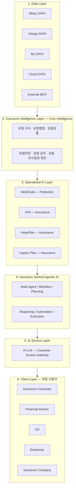

# 04. Platform Architecture

## 🤖 Insurance Vertical AI™

- **Insurance Vertical AI™** 는 보험산업에 특화된 전문 인공지능(Core Intelligence)으로,
  보험산업 전반에 필요한 보험 지식, 보험법령, 보험상품, 보험약관, 보험 실무를 이해하고
  보험과 관련된 의사결정과 업무를 지원하는 AI입니다.
- 보험은 복잡한 상품 구조와 지속적으로 변화하는 규제, 높은 수준의 전문성과 정확성이 요구되는 산업으로,
  범용 AI만으로는 이러한 요구를 충분히 충족하기 어렵습니다.
- iFA AI & Co.는 보험산업에 특화된 데이터와 전문지식, 그리고 실제 보험 실무 경험을 AI와 결합하여
  범용 AI가 제공하기 어려운 수준의 보험 전문성과 실행력을 갖춘 Insurance Vertical AI™를 개발하였습니다.
- iFA AI & Co.의 모든 AI 서비스는 하나의 공통 지능(**Common Intelligence**)인 Insurance Vertical AI™를 기반으로
  동작하며, 이를 통해 보험소비자, 보험설계사, GA가 보다 정확하고 과학적인 보험 의사결정을 내릴 수 있도록 지원합니다.
- Insurance Vertical AI™는 **사람을 대체하기 위한 AI가 아니라 사람의 전문성을 증강(Augment)하는 AI**입니다.
  보험설계사의 전문성과 생산성을 향상시키고, 고객에게는 전문가 수준의 보험 서비스를 제공함으로써
  보험산업 전반의 새로운 표준을 만들어가는 핵심 인공지능 플랫폼입니다.

### Insurance Vertical Agentic AI가 지원하는 고객의 보험 여정

1. 보험 분석
2. 보험 비교
3. 보험 추천
4. 보험 가입 지원
5. 계약 유지관리
6. 연금 관리
7. 상속 계획

---

## 🏛️ Vertical AI Platform Architecture

---

### 1. Data Layer

Insurance Vertical AI™가 학습하고 활용하는 데이터 계층입니다.

| 데이터 | 내용 |
|--------|------|
| **Micky DATA** | 보험이론, 재무학, 금융법령, 정부기관 자료, 보험회사 자료, 연구기관 자료 등 보험산업의 전문지식 데이터 |
| **Veluga DATA** | 보험상품, 보험약관, 상품방법서, 상품해설서 등 보험상품 데이터 |
| **My DATA** | 고객의 건강검진 데이터, 유전자 분석 데이터, 보험가입 데이터, 금융상품 데이터 |
| **Cloud DATA** | 보험가입 내역, 유지 내역, 민원 내역, 수수료 내역, 상담 이력 등 AI·Cloud 운영 데이터 |
| **External MCP** | 법령, 공공데이터, 제휴 데이터 등 |

### 2. Insurance Intelligence Layer (Core Intelligence)

보험산업 전반의 지식과 추론 능력을 갖춘 범용 보험 AI

- 보험 지식
- 보험법령
- 보험상품
- 보험약관
- 보험 실무
- 보험 의사결정 엔진

### 3. Specialized AI Layer

#### Insurance Domain (Protection AI)

- **MediCode** : 건강검진 데이터와 유전자 분석 데이터를 활용한 AI 기반 보장 설계
  - 개인별 위험 분석
  - 보장 최적화
  - 보험 가입 및 유지관리

#### Assurance Domain (Lifetime Financial Planning AI)

- **VFA** : 변액보험 및 변액연금의 수익률 관리 AI
  - 펀드 관리
  - 리밸런싱
  - 수익률 최적화
- **HopePlan** : AI 기반 은퇴 및 연금 설계
  - 은퇴소득 설계
  - 절세 전략
  - 연금 최적화
- **Legacy Plan** : AI 기반 상속 및 자산승계 설계
  - 상속 전략
  - 증여 전략
  - 가족 자산 이전 계획

### 4. Insurance Vertical Agentic AI

보험 업무를 스스로 계획하고 실행하는 Agent 계층

- Multi-Agent
- Workflow
- Planning
- Reasoning
- Automation
- Execution

### 5. AI Service Layer

사용자가 실제로 접하는 서비스 계층입니다.

- Gateway
- Customer Access
- **AI Link** : 보험소비자가 Insurance Vertical AI에 접근하는 AI Gateway입니다.
  고객은 AI Link를 통해 언제 어디서나 보험전문가 수준의 AI 서비스를 이용할 수 있습니다.

### 6. Client Layer

최종 사용자

- Insurance Consumer
- Financial Advisor
- GA
- Enterprise
- Insurance Company

---

## 아키텍처의 의미

이 구조는 **클라우드 플랫폼(AWS, Azure, Google Cloud)** 의 계층 구조와 유사한 형태로,
**"데이터(Data) → 공통 지능(Core Intelligence) → 전문 AI(Specialized AI) → 에이전트(Agentic AI) → 서비스(AI Link) → 사용자(Client)"** 의 흐름을 명확하게 보여줍니다.

또한 향후 새로운 보험 AI 서비스가 추가되더라도 **Specialized AI Layer만 확장하면 되는
확장 가능한(Scalable) 플랫폼 구조**를 자연스럽게 설명할 수 있습니다.
